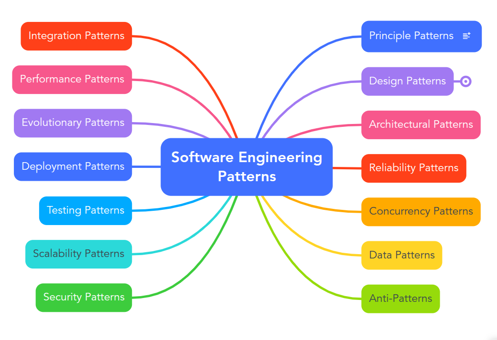

# Software engineering patterns

You may don't know what you don't know, a mind map can help you

See the mind map in detail: https://mm.tt/app/map/3600495906?t=ouhxD4pmvM

`Note`: to rate our undrestanding, we rate every pattern out of 5, every number from 1 to 5 has its own meaning

1. Understood the aim of the pattern
2. Understood the real example of pattern in the day-to-day life
3. Found some examples in the product code or open-source projects
4. Implemented an example in github gist
5. Sign of the pattern

If you follow all the 5 steps you understood the pattern deeply

* [Principle Patterns](#principle-patterns)
    - [SOLID](#solid)
        - [Single Responsibility](#single-responsibility)
        - [Open-Closed](#open-closed)
        - [Liskov](#liskov)
        - [Interface Segregation](#interface-segregation)
        - [Dependency Inversion](#dependency-inversion)
    - [DRY](#dry)
* [Design Patterns](#design-patterns)
    - [Creational](#creational)
        - [Factory Method](#factory-method)
        - [Abstract Factory](#abstract-factory)
        - [Builder](#builder)
        - [Prototype](#prototype)
        - [Singleton](#singleton)
    - [Behavioral](#behavioral)
        - [Chain of Responsibility](#chain-of-responsibility)
        - [Command](#command)
        - [Iterator](#iterator)
        - [Mediator](#mediator)
        - [Memento](#memento)
        - [Observer](#observer)
        - [State](#state)
        - [Strategy](#strategy)
        - [Template Method](#template-method)
        - [Visitor](#visitor)
    - [Structural](#structural)
        - [Adapter](#adapter)
        - [Bridge](#bridge)
        - [Composite](#composite)
        - [Decorator](#decorator)
        - [Facade](#facade)
        - [Flyweight](#flyweight)
        - [Proxy](#proxy)
* [Architectural Patterns](#architectural-patterns)
* [Reliability Patterns](#reliability-patterns)
* [Concurrency Patterns](#concurrency-patterns)
* [Data Patterns](#data-patterns)
* [Anti-Patterns](#anti-patterns)
* [Integration Patterns](#integration-patterns)
* [Performance Patterns](#performance-patterns)
* [Evolutionary Patterns](#evolutionary-patterns)
* [Deployment Patterns](#deployment-patterns)
* [Testing Patterns](#testing-patterns)
* [Scalability Patterns](#scalability-patterns)
* [Security Patterns](#security-patterns)

## Principle Patterns

Recommanded books: 
1. Matthias Noback - Principles of Package Design_ Creating Reusable Software Components-Apress (2018) - Part 1
2. Simple Object-Oriented Design: Create clean, maintainable applications

### SOLID 

Why do we need SOLID? 
I believe that most of developers know the 5 princples of SOLID but they don't know why they are using it, before reading the following sentence ask your self, if you could explain solid in just **one word** what would it be?

The word is **Change**, We all follow the SOLID to make our code changable, so if we wanted to write a project that we would never change it, maybe it's pointless to apply SOLID to our code.

#### Single Responsibility

Robert C. Martin (Uncle Bob) defines the Single Responsibility Principle as:
**Each software module should have one and only one reason to change.**

What violate the single responsibility?

* The class has many instance variable
* The class has many public methods
* Each method of the class uses different instance variables
* Specific tasks are delegated to private method

1. The Responsibility term is so confusing, what we define responsibility? What is exactly responsibility? maybe every developer has its own definition of responsibility. I think the better term to use for defining responsibility is cohesion. Responsibility are the reasons to change

2. Imagine you build a university and at the first you hire someone who does lots of things, but as more students gets into the university you want your employees work efficiently, so you may give them only one responsibility.

3. https://github.com/ory/dockertest/blob/207b20aded3b6876a3acb2a6cdc4447eb8f49bfc/docker/event.go#L121

4. https://gist.github.com/iamamirsalehi/de5b66e5615a46fd550634e3077fc9b2

5. Collaborator classes, if a package or class uses collaborator classes and does not do many works it means it follows single Reposibility pattern

#### Open-Closed

What violate the Open-Closed principle?
* It contains conditions to determine a strategy
* Conditions using the same variables or constants are recurring inside the
  class or related classes.
* The class contains hard-coded references to other classes or class names.
* Inside the class, objects are being created using the new operator.
* The class has protected properties or methods, to allow changing its behavior by overriding state or behavior.

1. You should be able to extend a class behaviour without modifying it. **A unit of code** can be considered **open for extension**. The fact the **no actual modification** is needed to change **the behaviour of a unit of code** makes it **closed** for modification

2. When you use your laptop and plug in your usd flash or your external hard drive, you don't have to make changes in your laptop to support these two kind of devices, you just use the USD port

3. https://github.com/iamamirsalehi/project-with-milad/blob/main/app/Application/Service/PaymentService/PaymentService.php

4. 

5. Extending a class behaviour by just passing to its constrcutor without changing the class itself, **Abstract factory** can also help to produce families of related objects without specifying their concrete 

#### Liskov

A program that uses an interface must not be confused by an implementation of that interface.

What violate the Liskov princple?

#### Interface Segregation

#### Dependency Inversion

### DRY

## Design Patterns

### Creational

#### Factory Method

#### Abstract Factory

#### Builder

#### Prototype

#### Singleton

### Behavioral

#### Chain of Responsibility

#### Command

#### Iterator

#### Mediator

#### Memento

#### Observer

#### State

#### Strategy

#### Template Method

#### Visitor

### Structural

#### Adapter

#### Bridge

#### Composite

#### Decorator

#### Facade

#### Flyweight

#### Proxy

## Architectural Patterns

### CQRS

## Reliability Patterns

### Circuit Breaker pattern

### Saga

## Concurrency Patterns

### Worker Pool

## Data Patterns

## Anti-Patterns

### Chatty I/O

## Integration Patterns

## Performance Patterns

## Evolutionary Patterns

## Deployment Patterns

### Canary releases
### Blue/green deployments
### Feature toggles
### Dark launches

## Testing Patterns

## Scalability Patterns

## Security Patterns